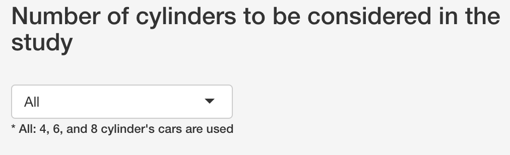
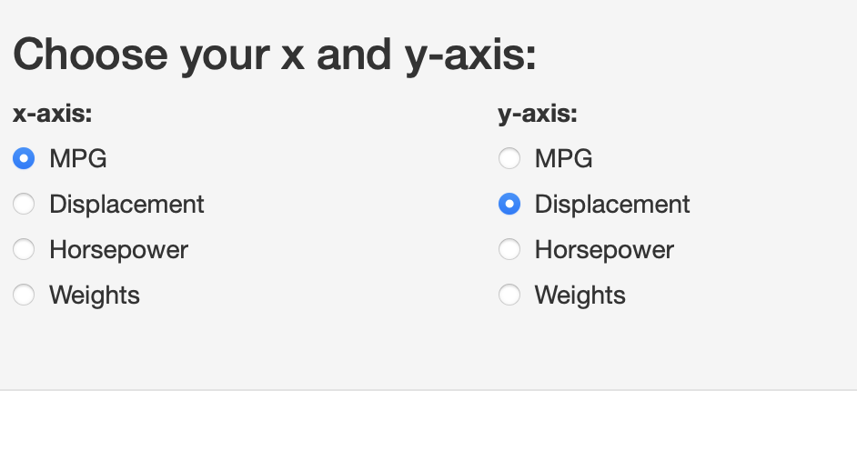
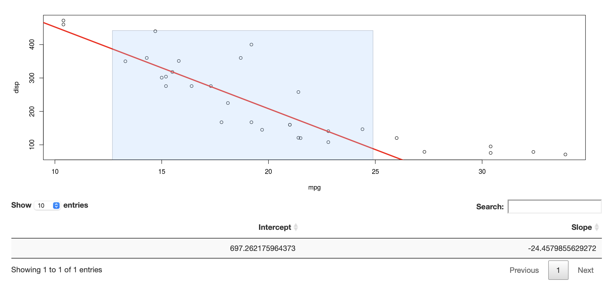
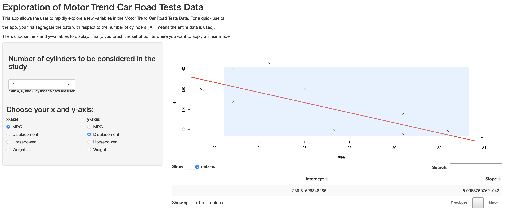

```{r setup, include=FALSE}
knitr::opts_chunk$set(echo = FALSE)
```

## How to use the app (1)

This app allows the user to rapidly explore a few variables in the Motor Trend Car Road Tests Data. For a quick use of the app:

- you first segregate the data with respect to the number of cylinders ('All' means the entire data is used). 

{ width=18cm }

- Then, choose the x and y-variables to display. 

{ width=18cm }

## How to use the app (2)


Finally, you brush the set of points where you want to apply a linear model.

{ width=40cm }


## Description of the app 

Selecting the number of cylinder will keep only cars with the corresponding number of cylinders for the study. For the 4 cylinders example, we have:

```{r, echo=TRUE}
nb_cyl <- 4
my_data <- mtcars[mtcars$cyl == nb_cyl,]
head(my_data)
```

Selecting the x and y-axis will scatter the variables to be explored. For the "x-axis = mpg" and "y-axis = disp" example, we have: 


```{r, echo=TRUE, out.width = "500cm", out.height = "280cm"}
plot(my_data$mpg,my_data$disp,xlab = "mpg", ylab = "disp")
```

## Description of the app

After brushing a set of points, a linear model is displayed on the plot and the intercept and the intercept and slope are provided in a table, as seen in this example:


{ width=40cm }